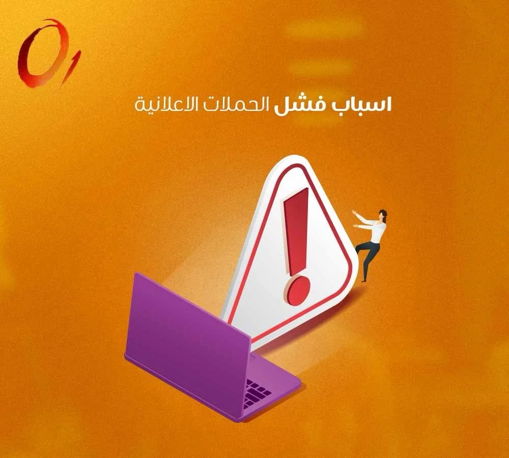

## إدارة الحملات الإعلانية والسوشيال ميديا

في عالم الأعمال اليوم، لم يعد التواجد الرقمي رفاهية، بل هو شريان الحياة لنمو المبيعات وتوسع الشركات. نجاح أي مشروع تجاري يرتبط بشكل وثيق بمدى احترافية [ادارة الحملات الاعلانية ](https://zero2one.sa/ar/services/digital-advertising/)وتوجيهها بدقة نحو الجمهور المستهدف. إطلاق الإعلانات دون استراتيجية واضحة يؤدي حتماً إلى هدر الميزانيات دون تحقيق أي عائد ملموس. من هنا تبرز الحاجة الملحة للتعاون مع شركة اعلانات سوشيال ميديا متمرسة مثل من الصفر إلى الواحد للتسويق الرقمي، قادرة على تحويل المتابعين إلى عملاء فعليين، واستثمار الميزانيات بذكاء لتحقيق أقصى عائد على الاستثمار (ROAS).

## لماذا تحتاج إلى خدمات التسويق الالكتروني والسوشيال ميديا؟

العديد من أصحاب المشاريع يعتقدون أن النشر اليومي على المنصات يكفي لجلب المبيعات، لكن الحقيقة أن الخوارزميات الحالية تقيد الوصول العضوي (المجاني) بشكل كبير. لكي تصل رسالتك التسويقية، يجب أن تدعمها بحملات ممولة مدروسة. تقديم خدمات التسويق الالكتروني والسوشيال ميديا بشكل متكامل يضمن لك،

•	الاستهداف الدقيق: الوصول للعملاء بناءً على العمر، الموقع الجغرافي، الاهتمامات الدقيقة، وحتى السلوك الشرائي السابق.

•	بناء الوعي بالعلامة التجارية: الظهور المتكرر والاحترافي أمام جمهورك يجعل علامتك التجارية الخيار الأول في أذهانهم عند اتخاذ قرار الشراء.

•	إعادة الاستهداف (Retargeting): الوصول للأشخاص الذين زاروا موقعك أو تفاعلوا مع إعلاناتك السابقة ولم يكملوا عملية الشراء، وتحفيزهم لإتمامها.

•	قياس الأداء بدقة: تتبع كل نقرة وكل عملية شراء، مما يسمح لفريق من الصفر إلى الواحد للتسويق الرقمي بتحسين الحملات بشكل فوري.

## أنواع الحملات الإعلانية وكيفية اختيار الأنسب لمشروعك

لكل هدف تسويقي أداة تناسبه، وتحديد أنواع الحملات الإعلانية بشكل صحيح هو حجر الأساس في نجاح خطتك التسويقية،

1. حملات الوعي والوصول (Awareness): تهدف إلى إيصال علامتك التجارية لأكبر عدد ممكن من الأشخاص بأقل تكلفة، وهي ممتازة عند إطلاق علامة تجارية جديدة أو افتتاح فرع جديد.
2. حملات التفاعل (Engagement): تركز على زيادة الإعجابات، التعليقات، والمشاركات، بالإضافة إلى زيادة عدد المتابعين الفعليين للصفحة.
3. حملات الرسائل المباشرة: من أقوى الأدوات في السوق الخليجي، حيث تحفز العميل المحتمل للنقر على الإعلان والانتقال مباشرة لمحادثة عبر واتساب أو ماسنجر مع فريق المبيعات الخاص بك.
4. حملات توليد العملاء المحتملين (Lead Generation): تعتمد على نماذج تعبئة البيانات (الاسم، رقم الهاتف، البريد)، وتستخدم بكثافة في القطاع العقاري، الطبي، والخدمات الاستشارية.
5. حملات التحويلات للمتاجر (Conversions): حملات ذكية تعتمد على تتبع سلوك المستخدم عبر "البيكسل"، وتستهدف الأشخاص الأكثر قابلية لإضافة المنتجات للسلة وإتمام الدفع الإلكتروني.

## ما هي تكلفة الحملات الاعلانية والعوامل المؤثرة فيها؟

السؤال الأكثر تكراراً في عالم التسويق هو كم تبلغ تكلفة الحملات الاعلانية؟ الواقع أن التكلفة تعتمد على نظام المزايدة (Bidding) وتتأثر بعدة عوامل جوهرية،

العامل المؤثر	تأثيره على تكلفة الحملة
المنصة الإعلانية	تختلف التكلفة من منصة لأخرى، سناب شات ولينكد إن غالباً أعلى تكلفة من فيسبوك وتيك توك، لكن العائد يختلف حسب نوع المنتج.
جودة المحتوى (Ad Relevance)	الإعلان الجذاب الذي يحصل على تفاعل عالٍ تقوم المنصة بمكافأته عبر تقليل تكلفة النقرة أو الظهور.
حجم الاستهداف	الاستهداف الواسع جداً قد يهدر الميزانية، والاستهداف الضيق جداً يرفع تكلفة الوصول، التوازن هو مفتاح النجاح.
المنافسة والمواسم	في مواسم الأعياد وتخفيضات نهاية العام، ترتفع التكلفة بشكل ملحوظ نتيجة زيادة أعداد المعلنين والمنافسة على نفس الجمهور.
الاستعانة بخبرات افضل شركة اعلانات مثل من الصفر إلى الواحد للتسويق الرقمي تضمن لك إدارة ميزانيتك بذكاء، وتقليل تكلفة الاستحواذ على العميل (CAC) إلى أدنى حد ممكن.

## أبرز أسباب فشل الحملات الإعلانية وكيفية تجنبها

الكثير من الشركات تنفق مبالغ ضخمة وتواجه شبح فشل الحملات الإعلانية، ويعود ذلك لعدة أخطاء استراتيجية قاتلة،

•	الاستهداف العشوائي وغير الدقيق: عرض إعلانات عقارات فاخرة لطلاب جامعيين، أو عرض منتجات تجميل لجمهور غير مهتم.

•	التصميم الباهت والمحتوى الضعيف: العميل يتعرض لآلاف الإعلانات يومياً، إذا لم يكن إعلانك يخطف البصر في أول 3 ثوانٍ، سيتم تجاهله فوراً.

•	غياب الدعوة لاتخاذ إجراء (CTA): الإعلان الذي لا يوجه العميل بخطوة واضحة (تسوق الآن، اتصل بنا، احجز استشارتك) يفقد قيمته البيعية.

•	إهمال تحليل البيانات والتحسين المستمر: إطلاق الحملة وتركها تعمل دون متابعة يومية وتعديل للميزانيات والاستهدافات هو وصفة أكيدة لخسارة الأموال.

•	مشاكل تقنية في صفحة الهبوط: توجيه العميل لموقع بطيء جداً، أو صفحة لا تحتوي على المنتج المُعلن عنه، مما يؤدي لارتداد العميل وخروجه فوراً.

## معايير اختيار افضل شركات الدعاية والاعلان في السعودية

السوق مليء بالوكالات، لكن اختيار افضل شركات الدعاية والاعلان في السعودية يتطلب التدقيق في عدة معايير لضمان نجاح شراكتك،

1. الخبرة في السوق المحلي: فهم ثقافة المستهلك السعودي، وطبيعة كل مدينة، والمواسم الشرائية الخاصة بالمملكة.
2. الشفافية في التقارير: توفير تقارير دورية واضحة تبين حجم الإنفاق، عدد مرات الظهور، تكلفة العميل، والعائد الفعلي على الاستثمار.
3. تكامل الخدمات: الشركات الرائدة لا تقدم خدمة واحدة فقط، بل تقدم خدمات اعلانية تسويقية متكاملة تشمل التصميم، كتابة المحتوى، وإدارة الحملات.

نحن في من الصفر إلى الواحد للتسويق الرقمي نتفوق عن شركات الدعاية والاعلان التقليدية بأننا نعتمد على لغة الأرقام والبيانات الدقيقة لتوجيه قراراتنا التسويقية، مما يضمن نمواً مستداماً لعملائنا.

## الأسئلة الشائعة حول إداره حملات إعلانية في السعودية

### 

### كيف تضمنون نجاح إداره حملات إعلانية في السعودية؟

النجاح يعتمد على استراتيجية واضحة، تبدأ بدراسة المنافسين، وتحديد شخصية العميل المثالي (Buyer Persona)، ثم اختيار المنصات الأنسب (تويتر، سناب شات، تيك توك، انستغرام)، وأخيراً متابعة الأداء وتحسينه يومياً عبر خبراء من الصفر إلى الواحد للتسويق الرقمي.

### هل ميزانية الإعلان الضخمة هي الحل الوحيد لزيادة المبيعات؟

إطلاقاً، الميزانية الضخمة دون استهداف ذكي هي هدر للمال. التركيز على جودة العرض التسويقي والمحتوى الجذاب قادر على تحقيق نتائج مذهلة بميزانيات معقولة ومدروسة.

### ما الفرق بين شركات الدعاية والاعلان الكلاسيكية ووكالات التسويق الرقمي؟

الشركات الكلاسيكية تركز على اللوحات الإعلانية في الشوارع والمطبوعات، حيث يصعب قياس العائد الفعلي من الإعلان. بينما وكالات التسويق الرقمي تعتمد على الاستهداف الرقمي الدقيق الذي يسمح بتتبع كل هللة تم إنفاقها ومعرفة حجم المبيعات الناتجة عنها بدقة متناهية.

عالم التسويق الرقمي يتطلب دقة، مرونة، وتحديثاً مستمراً للاستراتيجيات لضمان البقاء في صدارة المنافسين. لا تترك نجاح مبيعاتك للصدفة والمحاولات الفردية التي قد تستنزف ميزانيتك دون جدوى. الاستثمار الحقيقي يبدأ باختيار الشريك التقني والتسويقي الصحيح الذي يفهم أهدافك ويترجمها إلى أرقام فعلية. [تواصل مع خبراء من الصفر الى الواحد للتسويق الرقمي اليوم](https://zero2one.sa/ar/contact/)، ودعنا نرسم لك خارطة طريق واضحة لبناء حملات إعلانية ناجحة تحقق لك أقصى عائد وتصل بعلامتك التجارية إلى القمة.
