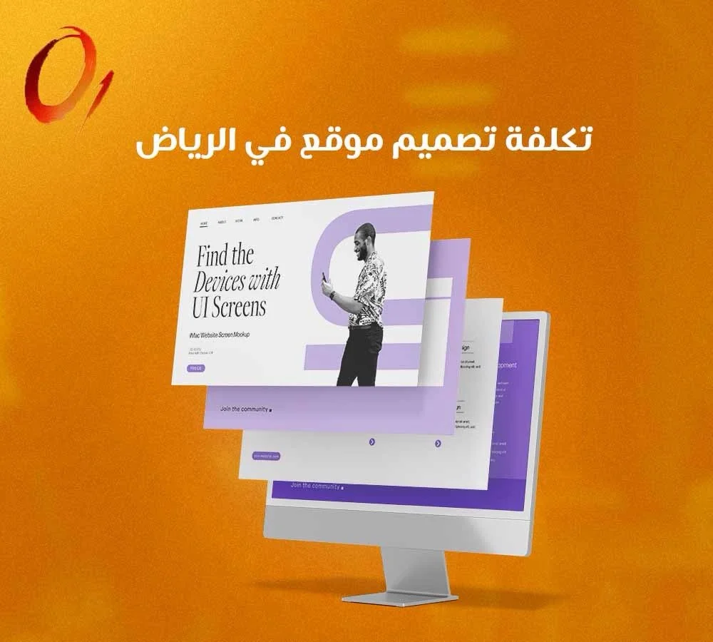

## **تصميم وتطوير المواقع والمتاجر الإلكترونية**

في بيئة الأعمال التنافسية اليوم، لم يعد التواجد الرقمي خياراً إضافياً، بل هو القاعدة الأساسية التي تبنى عليها قصص النجاح والمبيعات المستدامة. انطباع العميل الأول عن علامتك التجارية يتشكل في الثواني الأولى التي يقضيها داخل موقعك، مما يجعل الاستثمار في [تصميم وتطوير المواقع والمتاجر الإلكترونية وصفحات الهبوط](https://zero2one.sa/ar/services/web-design-riyadh/) خطوة حاسمة لا تقبل المساومة. هنا يبرز دور الخبراء في شركة **من الصفر إلى الواحد للتسويق الرقمي** لتحويل الأفكار المجردة إلى منصات رقمية تفاعلية، تضمن لك ليس فقط الظهور، بل التفوق على المنافسين وتحويل الزوار إلى عملاء دائمين.

## **تصميم مواقع إلكترونية في الرياض، واجهتك الرقمية الأولى**

السوق السعودي يشهد طفرة تقنية هائلة، والبحث عن خدمات تصميم مواقع إلكترونية في الرياض أصبح يتصدر أولويات أصحاب الأعمال. الموقع الإلكتروني هو فرع شركتك الذي لا يغلق أبوابه أبداً، يعمل على مدار الساعة لاستقبال العملاء، عرض الخدمات، والإجابة على الاستفسارات. ولتحقيق أقصى استفادة، يجب أن تتعاون مع شركة برمجة وتطوير مواقع سعودية تفهم متطلبات السوق المحلي وتتقن تصميم واجهات مستخدم احترافية تعكس هوية علامتك التجارية بوضوح.

الواجهة الجذابة وسهولة الاستخدام هما العاملان الحاسمان في بقاء الزائر داخل الموقع. نحن في **من الصفر إلى الواحد للتسويق الرقمي** نركز على تصميم رحلة مستخدم سلسة، تجعل التنقل بين صفحات الموقع متعة بصرية وعملية، مما يقلل من معدلات الارتداد ويزيد من فرص التفاعل مع خدماتك.

## **إنشاء متجر إلكتروني احترافي لمضاعفة مبيعاتك**

التجارة الإلكترونية لم تعد تقتصر على عرض المنتجات، بل هي تجربة تسوق متكاملة تبدأ من لحظة دخول العميل للمتجر وتنتهي بعملية دفع آمنة وناجحة. إنشاء متجر إلكتروني احترافي يتطلب بنية تحتية قوية، سرعة تصفح عالية، وتصنيفاً ذكياً للمنتجات يسهل عملية البحث.

عندما نطور متجرك في **من الصفر إلى الواحد للتسويق الرقمي**، نضمن لك ربطاً سلساً مع بوابات الدفع الإلكتروني المعتمدة، وشركات الشحن، مع توفير لوحة تحكم بسيطة تتيح لك إدارة المخزون وتتبع المبيعات لحظة بلحظة. المتجر الاحترافي هو الذي يبني الثقة مع العميل من خلال عرض المنتجات بصور عالية الدقة، وكتابة وصف تسويقي مقنع، وتوفير تجربة شراء خالية من التعقيد، وكل هذا نوفره لك كجزء من خدمات **من الصفر إلى الواحد للتسويق الرقمي**.

## **أهمية تصميم صفحة هبوط تضاعف التحويلات**

الحملات الإعلانية الناجحة تحتاج إلى وجهة نهائية مصممة خصيصاً لاستقبال الزوار وإقناعهم باتخاذ إجراء محدد، وهنا تكمن أهمية تصميم صفحة هبوط مخصصة. توجيه الزوار من الإعلان إلى الصفحة الرئيسية للموقع غالباً ما يشتت انتباههم، بينما تصميم صفحة هبوط احترافية يركز على هدف واحد فقط، سواء كان شراء منتج، التسجيل في دورة، أو حجز استشارة.

لكي تكون صفحة الهبوط فعالة، نحرص في **من الصفر إلى الواحد للتسويق الرقمي** على توفير عناصر أساسية،

1. **عنوان رئيسي جذاب،** يوضح القيمة المضافة والفائدة التي سيحصل عليها العميل فوراً.
2. **تصميم بصري مريح،** خالي من الروابط المشتتة والقوائم الجانبية لضمان تركيز الزائر على العرض.
3. **دعوة واضحة لاتخاذ إجراء،** أزرار بارزة ومقنعة مثل احجز الآن أو اطلب نسختك.
4. **سرعة تحميل فائقة،** لأن التأخير لجزء من الثانية قد يكلفك خسارة العميل المحتمل.

### **حلول رقمية مخصصة للقطاعات المهنية**

تختلف المتطلبات التقنية والتصميمية باختلاف القطاع التجاري، فالشركات الخدمية تحتاج لمواقع تبرز خبراتها، بينما القطاعات الأخرى تتطلب ميزات حجز وتفاعل مباشر.

## **أفضل شركة تصميم مواقع مكاتب المحاماة في الرياض**

قطاع المحاماة والاستشارات القانونية يتطلب مستوى عالياً من الموثوقية والسرية. بصفتنا أفضل شركة تصميم مواقع مكاتب المحاماة في الرياض، يقوم فريق **من الصفر إلى الواحد للتسويق الرقمي** بتطوير منصات تبرز الكفاءات القانونية للمكتب، وتعرض قضايا النجاح السابقة بطريقة احترافية. نوفر أنظمة لحجز الاستشارات القانونية عبر الإنترنت، ونضمن أعلى معايير الأمان لحماية بيانات العملاء والتواصل السري، مما يعزز الثقة ويبني صورة مؤسسية رصينة للمكتب.

## **أفضل شركة تصميم مواقع شركات السياحة في السعودية**

المملكة تشهد نهضة سياحية غير مسبوقة، ولتتمكن من المنافسة، يجب أن تقدم لعملائك تجربة استكشاف افتراضية مذهلة قبل حجز تذاكرهم. كخيارك الأول وأفضل شركة تصميم مواقع شركات السياحة في السعودية، نركز في **من الصفر إلى الواحد للتسويق الرقمي** على التصميم البصري الغني بالصور ومقاطع الفيديو الترويجية عالية الدقة. ندمج أنظمة حجز الرحلات، الفنادق، والبرامج السياحية بشكل سلس، مع دعم لغات متعددة وتوافق تام مع الهواتف المحمولة لخدمة السياح من كافة أنحاء العالم.

## **ضرورة تطوير مواقع سريعة ومتوافقة مع السيو**

الموقع الجميل لا قيمة له إذا لم يتمكن العملاء من العثور عليه في محركات البحث. لذلك، تطوير مواقع سريعة ومتوافقة مع السيو يعتبر الركيزة الأساسية في منهجية عملنا. سرعة الموقع تلعب دوراً حاسماً في ترتيبك على محرك بحث جوجل، فالمواقع البطيئة تتعرض لعقوبات بتخفيض ترتيبها، ناهيك عن انزعاج الزوار وخروجهم المبكر.

نعمل في **من الصفر إلى الواحد للتسويق الرقمي** على تحسين الأكواد البرمجية، ضغط الصور، واستخدام خوادم استضافة قوية لضمان سرعة تحميل استثنائية. بالإضافة إلى ذلك، نبني هيكلة الموقع منذ اليوم الأول لتكون صديقة لمحركات البحث، مما يضمن تصدرك للنتائج الأولى عند بحث العملاء عن خدماتك، وبالتالي الحصول على تدفق مستمر للزيارات المجانية عبر تقنيات **من الصفر إلى الواحد للتسويق الرقمي**.

## **ما هي تكلفة تصميم موقع في الرياض؟**

تحديد تكلفة تصميم موقع في الرياض ليس رقماً ثابتاً، بل هو استثمار يعتمد على حجم المشروع ومتطلباته التقنية. لمعرفة التكلفة التقريبية، يجب النظر في العوامل المؤثرة التالية،

| **العامل المؤثر في التكلفة** | **التفاصيل والأهمية** |
| **حجم الموقع وعدد الصفحات** | المواقع التعريفية البسيطة تختلف تكلفتها عن المتاجر الإلكترونية الضخمة التي تحتوي على آلاف المنتجات. |
| **التصميم المخصص مقابل القوالب الجاهزة** | التصميم البرمجي الخاص يعكس تفرد هويتك ويتطلب جهداً أكبر من استخدام القوالب الجاهزة المفتوحة. |
| **الميزات التقنية الإضافية** | ربط بوابات الدفع، أنظمة الحجز المتقدمة، وتعدد اللغات يزيد من الجهد البرمجي والتكلفة. |
| **خدمات ما بعد الإطلاق** | الصيانة الدورية، التحديثات الأمنية، والدعم الفني المستمر تعتبر جزءاً هاماً من الاستثمار التقني. |

نحن في [**من الصفر إلى الواحد للتسويق الرقمي**](https://zero2one.sa/ar/about/) نقدم باقات مرنة تناسب الشركات الناشئة والمؤسسات الكبرى، مع ضمان أعلى جودة تقنية وأفضل عائد على استثمارك.

## **الأسئلة الشائعة**

### **كيف أضمن نجاح المتجر الإلكتروني بعد إطلاقه؟**

النجاح يعتمد على اختيار منصة سريعة، تصميم واجهات مستخدم احترافية، وربط المتجر بأدوات التحليل المتقدمة، ثم دعم ذلك بحملات إعلانية مدروسة عبر فريق **من الصفر إلى الواحد للتسويق الرقمي**.

### **هل تصميم صفحة هبوط واحدة يكفي للحملات الإعلانية؟**

يُنصح بتصميم صفحة هبوط مخصصة لكل حملة إعلانية أو لكل منتج على حدة. توحيد الرسالة الإعلانية مع محتوى الصفحة يرفع من معدلات التحويل بشكل ملحوظ.

### **كم يستغرق إنشاء وتطوير موقع إلكتروني احترافي؟**

تختلف المدة الزمنية حسب حجم المشروع، المواقع التعريفية قد تستغرق أسابيع قليلة، بينما المتاجر الكبيرة والمنصات المتخصصة تحتاج إلى وقت أطول لضمان الجودة البرمجية واختبار الأداء.

### **هل تقدمون خدمات الصيانة بعد إطلاق الموقع؟**

بالتأكيد، نحن في **من الصفر إلى الواحد للتسويق الرقمي** نعتبر إطلاق الموقع هو بداية الشراكة، ونقدم خدمات الدعم الفني، التحديثات الأمنية، وتحسين الأداء لضمان استقرار أعمالك.

العالم الرقمي يتطور بسرعة، والتأخر في بناء هويتك الرقمية يعني ترك الساحة لمنافسيك. الاستثمار في تصميم احترافي، متجر سريع، وصفحات هبوط مقنعة هو خطوتك الأولى نحو مضاعفة الأرباح وبناء علامة تجارية قوية. لا تترك واجهتك الرقمية للحلول المؤقتة،[ **تواصل مع خبراء من الصفر الى الواحد للتسويق الرقمي** ](https://zero2one.sa/ar/contact/)اليوم، ودعنا نبتكر لك منصة تقنية متكاملة تتصدر نتائج البحث وتأسر انتباه عملائك من النظرة الأولى.
